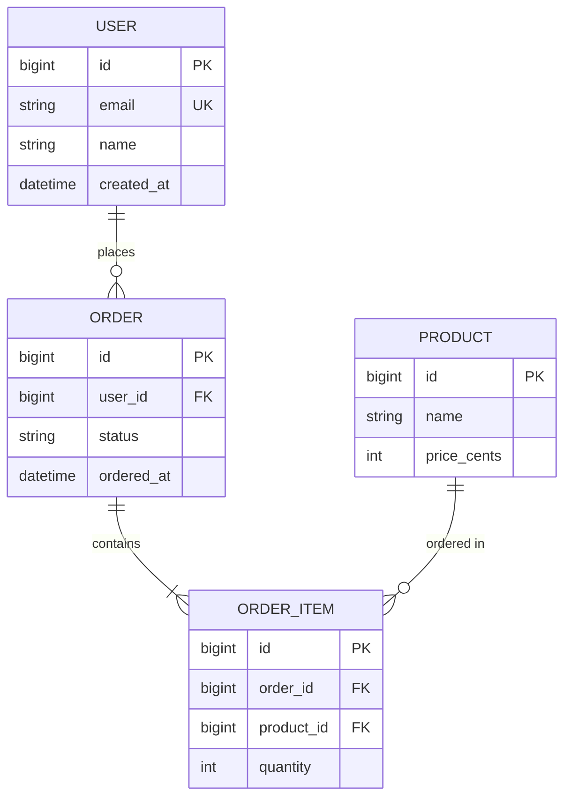
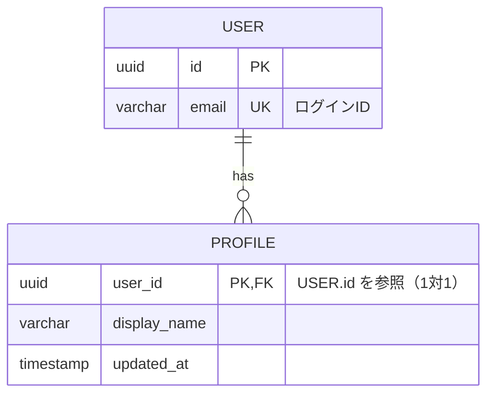

# DB設計（Database Design）

## Overview

要件を満たすために永続データの保存・検索が必要な場合に、データベースのスキーマを設計し
`docs/DATABASE.md` にまとめる。エンティティ・属性・関連・キー・制約・インデックスを定義し、
**ER図を Mermaid 記法で Markdown に埋め込む**ことで、図を別ツールなしにそのまま閲覧・レビューできる。
データモデルの誤りは最も修正コストが高いため、実装前にここで固める。

## When to Use

- 設計フェーズで、要件にデータの永続化・検索・集計・履歴などが含まれるとき
- 既存スキーマにテーブル/カラムを追加・変更する必要があるとき

**まず「DB設計が必要か」を判断する。** 次のような場合は永続DBが不要なことがある:
静的サイト、ステートレスなAPIゲートウェイ/プロキシ、外部サービスのみにデータを委譲する構成、
クライアント内に閉じる一時データのみ。**不要と判断したら、その理由を記録して設計をスキップする**
（無理にDBを作らない）。

**前提**: `docs/REQUIREMENTS.md` が存在すること。`docs/TECH_STACK.md`（採用DB）と
`docs/DESIGN.md`（概念データモデル）があれば必ず入力にする。

## Process

### 1. DB設計の要否を判断する

要件を見て、永続化・問い合わせが必要なデータがあるかを確認する。なければ「DB不要」と理由を残して終了。
ある場合は採用DBの種別（RDB / ドキュメント / KVS など）を `docs/TECH_STACK.md` で確認する。

### 2. 入力を読む

- `docs/REQUIREMENTS.md` — 扱うデータ、関連、量・成長・保持期間、検索/集計要件、整合性要件
- `docs/TECH_STACK.md` — 採用DB（RDB か NoSQL か等。設計様式が変わる）
- `docs/philosophy/PLAN_PHILOSOPHY.md` — 正規化/非正規化の方針、データ整合性 vs 性能の優先度
- `docs/DESIGN.md` — アーキ設計で定めた概念データモデル
- 既存スキーマ・マイグレーション（あれば整合を取る）

### 3. エンティティと関連を抽出する

- エンティティ（テーブル/コレクション）と属性を洗い出す
- 関連とカーディナリティ（1対1 / 1対多 / 多対多）を決める。多対多は中間テーブルを検討する

### 4. スキーマを設計する

- 各テーブル/コレクション: カラム/フィールド名・データ型・NULL可否・デフォルト・制約（UNIQUE/CHECK等）
- 主キー（PK）と外部キー（FK）、参照整合性・カスケード方針
- 正規化方針（基本は正規化）。非正規化する場合は PLAN_PHILOSOPHY の性能優先度に基づき**理由を残す**
- インデックス設計（検索/結合/ソートに使うカラム）。過剰なインデックスは書き込みコストを増やす点も考慮
- データ量・成長見積もり、必要ならパーティション/シャーディング方針

### 5. 要件との対応を確認する

データに関わる受け入れ条件・機能要件が、スキーマで満たせることを確認する（対応を追跡可能にする）。

### 6. ER図（Mermaid）を作成し、docs/DATABASE.md にまとめる

ER図は Mermaid の `erDiagram` で記述し、Markdown に埋め込む。以下の構成で保存する。

````markdown
# DB設計: <プロジェクト/機能名>

## 1. 概要（採用DB・設計方針／PLAN_PHILOSOPHY との対応）

## 2. ER図



## 3. テーブル/コレクション定義
   ### <テーブル名>
   - 役割: <何を表すか>
   - カラム:
     | カラム | 型 | NULL | 制約/キー | 説明 |
     |---|---|---|---|---|
   - インデックス: <対象カラムと種類>

## 4. リレーションとカーディナリティ
## 5. 正規化/非正規化の方針と理由
## 6. インデックス設計
## 7. 制約・整合性・データ量見積もり
## 8. マイグレーション/初期データの方針
## 9. 要件との対応（データ関連の受け入れ条件 × 対応テーブル）
````

> NoSQL（ドキュメント/KVS等）の場合も、コレクション/ドキュメントとその参照関係を `erDiagram` で表現する
> （埋め込み vs 参照の方針を「正規化/非正規化」の節に記す）。

#### Mermaid `erDiagram` 記法ルール（パースエラーを防ぐ）

属性の1行は **`型 属性名 [キー] ["コメント"]`** の順。次のルールを必ず守る。

- **キーは `PK` / `FK` / `UK` のみ。複数付与は半角カンマ区切りで `PK, FK` と書く。**
  `PK_FK` や `PKFK` のような結合表記は不正で、`Expecting 'ATTRIBUTE_WORD', got 'COMMENT'` 等のパースエラーになる。
- **型は空白・括弧を含まない単一トークンにする**（`uuid` `bigint` `varchar` `timestamp` `boolean` など）。
  `varchar(255)` のような括弧付きや `nullable int` のような空白入りは避け、長さ・NULL可否はコメントや本文の表に書く。
- **コメントは必ずダブルクオートで囲む**（`"auth.users.id を参照"` 等）。記号始まりでも引用符内なら可だが、簡潔にする。
- 属性名・エンティティ名は英数字とアンダースコアのみ（日本語やハイフン・空白を入れない。説明は引用符コメントへ）。
- リレーションは `ENTITY1 ||--o{ ENTITY2 : ラベル`。ラベルに空白を含めるなら `"ordered in"` のように引用符で囲む。

正しい例（複合キー・参照コメント付き）:



避けるべき例（パースエラーになる）:

```text
uuid id PK_FK "= auth.users.id"      # ✗ PK_FK は不正 → PK, FK にする
varchar(255) name                    # ✗ 型に括弧 → varchar にし長さはコメント/本文へ
顧客 id PK                            # ✗ 日本語のエンティティ/属性名は不可
```

### 7. 人間のレビューを受ける

スキーマと ER 図をレビューしてもらい、承認後に実装フェーズへ進む。

## Common Rationalizations

| 言い訳 | 実際 |
|---|---|
| 「実装しながらテーブルを足せばいい」 | スキーマの後付け変更はデータ移行を伴い最も高コスト。実装前に固めるのが最も安い。 |
| 「ER図は描かなくても分かる」 | 関連とカーディナリティは図にすると誤りが見える。Mermaid なら Markdown 内でそのまま描画できる。 |
| 「とりあえず全部 string でいい」 | 型・制約はデータ整合性の最前線。型・NULL可否・UNIQUE を曖昧にすると不正データが入る。 |
| 「インデックスは後で貼る」 | 検索要件に対するインデックス設計は性能の土台。設計時に検索パターンから決める。 |
| 「正規化は常に正しい」 | 性能要件次第で非正規化が妥当な場合もある。PLAN_PHILOSOPHY の優先度に基づき理由付きで選ぶ。 |
| 「永続データが無くてもDBは作る」 | 不要なDBは複雑性を増やすだけ。要否を判断し、不要なら理由を残してスキップする。 |

## Red Flags

- ER図がない、または関連のカーディナリティが不明
- カラムの型・NULL可否・制約・キーが定義されていない
- 検索/結合要件があるのにインデックス設計がない
- 非正規化しているのに理由が書かれていない
- データ関連の受け入れ条件とスキーマの対応が取れていない
- 永続データが不要なのにDBを設計している（逆に、必要なのに判断を飛ばしている）
- Mermaid 記法が不正（`PK_FK` などの結合キー表記、型に括弧/空白、日本語の属性名）でER図が描画できない

## Verification

実装フェーズに進む前に確認する:

- [ ] DB設計の要否を判断し、不要なら理由を記録した
- [ ] 必要な場合、全エンティティ・属性・関連・カーディナリティを定義した
- [ ] カラムの型・NULL可否・制約・PK/FK が定義されている
- [ ] 検索要件に対するインデックス設計がある
- [ ] 正規化/非正規化の方針と理由が書かれている
- [ ] ER図が Mermaid（`erDiagram`）で `docs/DATABASE.md` に埋め込まれている
- [ ] ER図が記法ルールに沿い描画できる（複合キーは `PK, FK`、型は単一トークン、名前は英数字＋`_`）
- [ ] データ関連の受け入れ条件とスキーマの対応が取れている
- [ ] 人間がレビューした

## 次のステップ

DB設計が確定したら（または不要と判断したら）実装フェーズへ。`/implement`（`implementation` スキル）は
`docs/DATABASE.md` をデータ層の実装・マイグレーションの基準として参照する。
